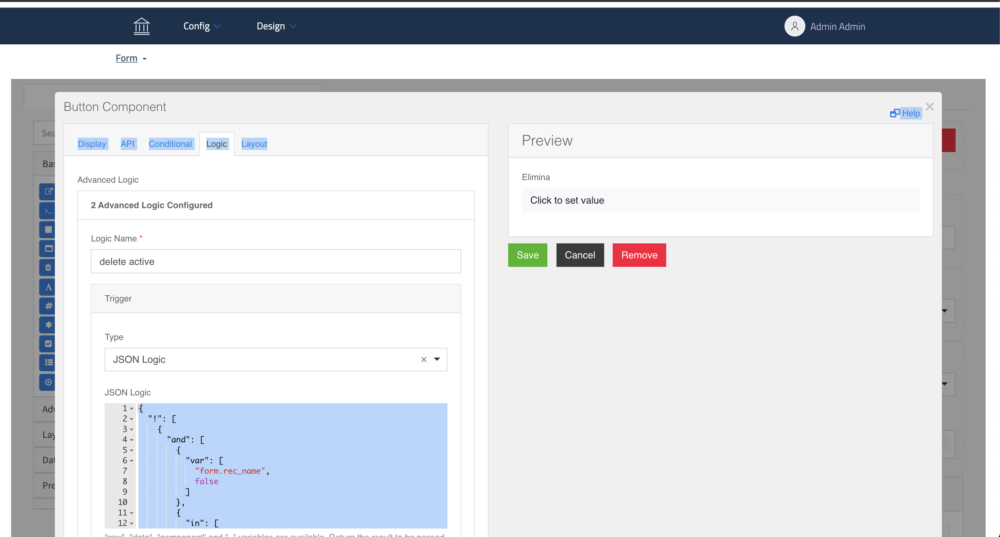
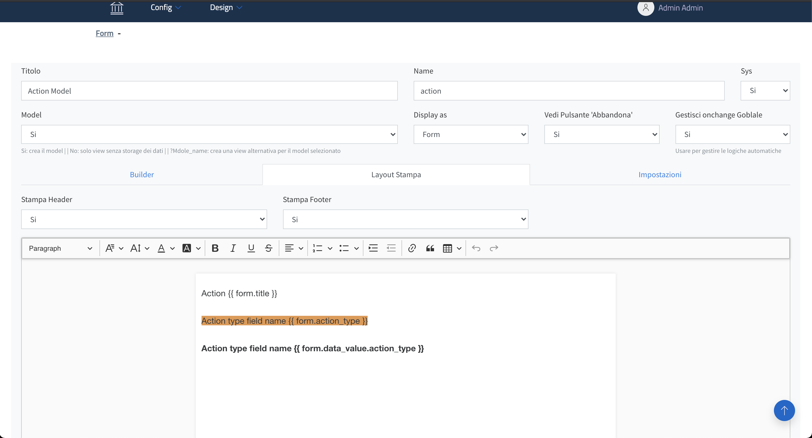

[](https://github.com/INRIM/service-app/actions?query=workflow%3ACodeQL "Code quality workflow status")

# Service App

Service App is a project and framework designed to

- RAD framework
- design form with formio builder and render with CRUD Api that implement
  italian [AGID Theme](https://github.com/italia/bootstrap-italia/)
- available plugin class system to build your own backend and/or frontend custom service
- documentation for plugin development is in WIP

### TODO

- i18n
- automated test
- FomIo component TODO list [available here](https://github.com/INRIM/service-app/blob/master/web-client/core/themes/italia/README.md)

## Features

- Design your form with Form.io builder for more info about Form.io see [Form.io homepage](https://www.form.io)
- View Form, the form is server side rendered with jinja template
- Add and Edit Data with yours forms
- MongoDB based
- And more

## Build Demo

- #### Config

    ```
    cp ._env.template.demo .env
    cp ._env-client.template.demo .env-client
    ```

- #### Build and run
    ```
    ./build_and_run.sh
    ```

- #### app
    ```
     http://localhost:8526/
    ```
  open [Service App](http://localhost:8526/login/) in your browser 
  
- #### Login 
  
   - user:  **admin**
   - password: **admin**
  
- ### Backend Api OSA3
 
  - [ReDoc](http://localhost:8225/redoc)

## Build Prod or Test

- #### Config
    ```
    cp .env.template .env
    cp .env-client.template .env-client
    ```
  edit basic data
- #### Build and run
    ```
    ./build_and_run.sh
    ```

- #### app
    ```
     http://localhost:8526/
    ```
  open [Service App](http://localhost:8526/) in your browser







## Docker Compose version

install/update docker compose from [Docker Compose Repo](https://github.com/docker/compose/releases)
mkdir -p ~/.docker/cli-plugins/
wget -O ~/.docker/cli-plugins/docker-compose https://github.com/docker/compose/releases/download/2.2.3/docker-compose-<SO>
chmod a+x ~/.docker/cli-plugins/docker-compose

## Dependencies:

* [FastApi](https://fastapi.tiangolo.com) - The Api framework
* [Form.io](https://www.form.io)
* [Jinja](https://github.com/pallets/jinja) - Jinja is a fast, expressive, extensible templating engine
* [AGID Theme](https://github.com/italia/bootstrap-italia/)
* [jQuery QueryBuilder](https://querybuilder.js.org/)

Authors
------------

- Alessio Gerace

## License

This project is covered by a [MIT license](https://github.com/INRIM/service-app/blob/master/LICENSE).