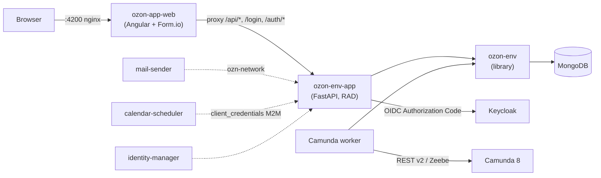

# Architecture

## Stack overview



- **`ozon-env-app` (backend)** — FastAPI: runtime models generated from
  schemas, action router, 3-layer ACL, plugins, NDJSON streaming, Camunda
  gateway. Backend and workers **never talk to MongoDB directly**: every data
  access goes through the **[`ozon-env`](https://github.com/archetipo/ozon-env)**
  library (PyPI `ozon-env`), which provides models, sessions and ORM.
- **`ozon-app-web` (frontend)** — Angular 20 + `@formio/angular`, AG Grid,
  Bootstrap Italia + Design Angular Kit. Nginx sits on a single origin and
  proxies `/api/*`, `/login`, `/logout`, `/auth/*` to the backend: no CORS,
  single-origin session cookies.
- **MongoDB** — the only persistence, accessed exclusively through
  `ozon-env`. Every "model" is a component (Form.io schema) from which the
  engine generates dynamic Pydantic models.
- **Keycloak** — handles authentication only (OIDC SSO). `is_admin` and roles
  do not come from Keycloak: they come from `group_users` in Mongo.
- **Companion services** — `mail-sender`, `calendar-scheduler`,
  `identity-manager`: self-contained containers with a `manifest.json` and
  their own compose, attached to the external `ozn-network` network, wired to
  the core by the *service registry*.
- **Camunda workers** — external service tasks based on `ozon-env`; they talk
  directly to Mongo (not to the app) and to Camunda REST v2.

## Multi-tenant by `APP_CODE`

A single backend serves multiple clients. Each frontend (`app/` instance)
carries its own `APP_CODE`; the backend selects it per request:

1. `?app_code=` query param
2. cookie
3. fallback to `APP_CODE`/`OZON_APP_CODE` environment variables

Menu, cards and data are scoped by `app_code` (e.g. `menu_group` records are
filtered by `app_code`), and ACL groups live in `group_users` as
`(app_code, group, users[])` rows.

## Plugins on `/plugins/<app_code>/`

An app's forms/models are a **plugin**: a folder with

```
plugins/<name>/
├── config.json             # manifest: module_name, schema, datas, depends
├── schema/components.json  # the forms (same Form.io format as 2.x)
└── data/                   # additional seeds (menu_group, action, ...)
```

The minimal manifest:

```json
{
  "module_name": "demo",
  "schema": "/schema/components.json",
  "datas": [
    { "menu_group": "/data/menu_group.json" },
    { "action": "/data/action.json" }
  ],
  "depends": []
}
```

The base plugin (identity, groups, actions) is included in the image; external
plugins are mounted at `/plugins/<name>` (bind mount or volume) and are
discovered and installed into Mongo at startup: the `schema` is upserted into
the `component` collection at every startup (unless `no_update: true`), and
`datas` are upserted by `rec_name`.

When a component is saved from the builder with `create_menu_dashboard`, the
backend generates the dashboard card and the 6 default actions (`list_`,
`new_`, `form_form_`, `submit_`, `copy_`, `delete_`) cloned from the `sys`
templates of the base plugin.

## Authentication: Keycloak + application session (BFF)

- The frontend never touches tokens: cookie auth (`ozon_session` httponly +
  `ozon_csrf`), `X-CSRF-Token` header on requests.
- `/login` redirects to Keycloak (Authorization Code); `/auth/callback`
  exchanges the code and opens an application session of its own.
- `GET /get_session` exposes only `uid`, `username`, `authenticated`,
  `app_code` — never tokens or raw JWT claims.
- Authorization does not come from Keycloak: `is_admin` and groups come from
  `group_users` in Mongo.

Details in [Keycloak and session](guides/keycloak-auth.md).

## 3-layer ACL

The ACL engine governs who sees a model, who sees/writes a field and who sees
a row, starting from the same config (`component.properties`) with different
enforcement:

| Layer | Decides | Fail mode |
|---|---|---|
| 1. `models_groups` | CRUD+export at **model** level, per group | totally fail-closed |
| 2. `record_rules` | which **rows** can be acted on (mongo filters) | no match → deny |
| 3. `fields_rule` | which **fields** are masked (obfuscate/deny) | masks when no group matches |

Model-level and record-level combine in **AND**: record rules can only
restrict, never grant verbs denied at model level. Details and examples in
[ACL: model, record, field](guides/acl.md).

## External services and registries

- **Service registry** — a function of the core: `service_registry` and
  `service_registry_repo` models, API under `/services/registry`; companions
  are built/started from their own compose when the registry starts them.
- **Core webhooks** — the backend can call external services for ACL, user
  management and synchronization (`data.before_write`, `user.after_create`,
  `calendar.task.*`, ...), with HMAC signing and configurable fail mode.
- **Remote selects** — select options can come from internal models or remote
  URLs, resolved **server-side** from the component (no SSRF).

## Workers and Camunda

BPMN processes (Camunda 8) integrate with the backend in two ways: the
application **gateway** (`/gateway/camunda/...`) to start processes and
complete user tasks under the application ACL, and **service task workers**
(`ozon-env-app/workers/ozon_camunda_worker`) that work directly against the
DB with an `ozon-env` session. Details in
[Workers and Camunda](wizard/step-5-workers-camunda.md).