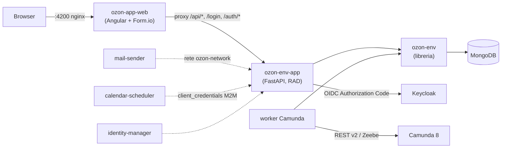

# Architettura

## Panoramica dello stack



- **`ozon-env-app` (backend)** — FastAPI: modelli runtime generati dagli
  schemi, action router, ACL a 3 livelli, plugin, streaming NDJSON, gateway
  Camunda. Backend e worker **non parlano con MongoDB direttamente**: ogni
  accesso ai dati passa per la libreria **[`ozon-env`](https://github.com/archetipo/ozon-env)**
  (PyPI `ozon-env`), che fornisce modelli, sessioni e ORM.
- **`ozon-app-web` (frontend)** — Angular 20 + `@formio/angular`, AG Grid,
  Bootstrap Italia + Design Angular Kit. Nginx sta su una sola origin e
  proxya `/api/*`, `/login`, `/logout`, `/auth/*` verso il backend: niente
  CORS, cookie di sessione single-origin.
- **MongoDB** — l'unica persistenza, accessibile solo tramite `ozon-env`.
  Ogni "model" è un component (schema Form.io) da cui il motore genera
  modelli dinamici Pydantic.
- **Keycloak** — gestisce solo l'autenticazione (SSO OIDC). `is_admin` e i
  ruoli non vengono da Keycloak: vengono da `group_users` in Mongo.
- **Companion service** — `mail-sender`, `calendar-scheduler`,
  `identity-manager`: container autonomi con `manifest.json` e compose
  proprio, collegati alla rete esterna `ozn-network`, collegati al core dal
  *service registry*.
- **Worker Camunda** — service task esterni basati su `ozon-env`; accedono ai
  dati tramite `ozon-env` (non chiamano l'app) e parlano con Camunda REST v2.

## Multi-tenant per `APP_CODE`

Un solo backend serve più client. Ogni frontend (istanza di `app/`) porta il
proprio `APP_CODE`; il backend lo seleziona per request:

1. query param `?app_code=`
2. cookie
3. fallback su `APP_CODE`/`OZON_APP_CODE` d'ambiente

Menu, card e dati sono scoped per `app_code` (es. i `menu_group` vengono
filtrati per `app_code`), e i gruppi ACL vivono in `group_users` come righe
`(app_code, group, users[])`.

## Plugin su `/plugins/<app_code>/`

Le form/i modelli di un'app sono un **plugin**: una cartella con

```
plugins/<nome>/
├── config.json             # manifest: module_name, schema, datas, depends
├── schema/components.json  # le form (stesso formato Form.io della 2.x)
└── data/                   # seed aggiuntivi (menu_group, action, ...)
```

Il manifest minimo:

```json
{
  "module_name": "demo",
  "schema": "/schema/components.json",
  "datas": [
    { "menu_group": "/data/menu_group.json" },
    { "action": "/data/action.json" }
  ],
  "depends": []
}
```

Il plugin base (identità, gruppi, azioni) è incluso nell'immagine; i plugin
esterni si montano in `/plugins/<nome>` (bind mount o volume) e vengono
scoperti e installati in Mongo all'avvio: lo `schema` viene upsertato nella
collection `component` a ogni avvio (salvo `no_update: true`), i `datas` sono
upsertati per `rec_name`.

Quando si salva un component dal builder con `create_menu_dashboard`, il
backend genera da solo la card della dashboard e le 6 action di default
(`list_`, `new_`, `form_form_`, `submit_`, `copy_`, `delete_`) clonate dai
template `sys` del plugin base.

## Autenticazione: Keycloak + sessione applicativa (BFF)

- Il frontend non tocca token: auth a cookie (`ozon_session` httponly +
  `ozon_csrf`), header `X-CSRF-Token` sulle richieste.
- `/login` reindirizza a Keycloak (Authorization Code); `/auth/callback`
  scambia il code e apre una sessione applicativa propria.
- `GET /get_session` espone solo `uid`, `username`, `authenticated`,
  `app_code` — mai token o claim JWT raw.
- Le autorizzazioni non vengono da Keycloak: `is_admin` e i gruppi arrivano
  da `group_users` in Mongo.

Dettagli in [Keycloak e sessione](guides/keycloak-auth.md).

## ACL a 3 livelli

Il motore ACL governa chi vede un model, chi vede/scrive un campo e chi vede
una riga, partendo dalla stessa config (`component.properties`) con
enforcement diverso:

| Livello | Cosa decide | Fail mode |
|---|---|---|
| 1. `models_groups` | CRUD+export a livello di **model**, per gruppo | fail-closed totale |
| 2. `record_rules` | su quali **righe** si può agire (filters mongo) | nessun match → nega |
| 3. `fields_rule` | quali **campi** sono oscurati (obfuscate/deny) | oscura se nessun gruppo matcha |

Model-level e record-level si combinano in **AND**: le record rule possono
solo restringere, non concedere verbi negati a livello model. Dettagli ed
esempi in [ACL: model, record, field](guides/acl.md).

## Servizi esterni e registri

- **Service registry** — funzione del core: modelli `service_registry` e
  `service_registry_repo`, API sotto `/services/registry`; i companion
  vengono buildati/avviati dal loro compose autonomo quando il registry li
  avvia.
- **Core webhooks** — il backend può chiamare servizi esterni per ACL,
  gestione utenti e sincronizzazioni (`data.before_write`, `user.after_create`,
  `calendar.task.*`, ...), con firma HMAC e fail mode configurabile.
- **Select remote** — le opzioni dei select possono venire da modelli interni
  o URL remoti, risolti **server-side** dal component (no SSRF).

## Worker e Camunda

I processi BPMN (Camunda 8) si integrano con il backend in due modi:
il **gateway** applicativo (`/gateway/camunda/...`) per avviare processi e
completare task user con l'ACL applicativa, e i **worker** service task
(`ozon-env-app/workers/ozon_camunda_worker`) che lavorano direttamente sul DB
con una sessione `ozon-env`. Dettagli in [Worker e Camunda](wizard/step-5-workers-camunda.md).